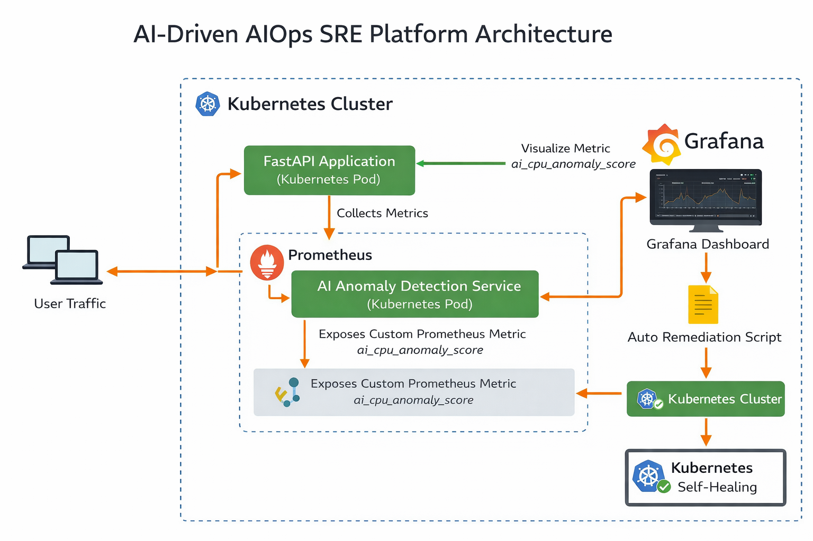

# AI-Driven AIOps SRE Platform

An AI-powered Kubernetes monitoring and self-healing platform that detects CPU anomalies using machine learning and automatically remediates issues.

---

## Tech Stack

* Kubernetes
* Prometheus
* Grafana
* FastAPI
* Python
* Machine Learning (Isolation Forest)

---

## Architecture Diagram



---

## Architecture Flow

User Traffic
↓
FastAPI Application (Kubernetes Pod)
↓
Prometheus collects metrics
↓
AI Anomaly Detection Service
↓
ai_cpu_anomaly_score metric
↓
Grafana Dashboard
↓
Auto Remediation Script
↓
Kubernetes Self-Healing

---

## Features

* Kubernetes-based microservice deployment
* Real-time monitoring with Prometheus
* Grafana dashboards for observability
* AI anomaly detection for CPU usage
* Custom Prometheus metric `ai_cpu_anomaly_score`
* Automated remediation using Kubernetes restart
* Self-healing infrastructure

---

## Demo / Proof

### Kubernetes Pods Running

```
kubectl get pods -n aiops
```

Example output:

```
NAME                                  READY   STATUS    RESTARTS
aiops-fastapi-xxxxxxx                 1/1     Running
ai-anomaly-service-xxxxxxx            1/1     Running
```

---

### Prometheus Metric

Query:

```
ai_cpu_anomaly_score
```

Example result:

```
ai_cpu_anomaly_score 0
```

0 = Normal
1 = CPU anomaly detected

---

### Auto Remediation

When anomaly is detected:

```
⚠️ Anomaly detected! Restarting FastAPI deployment...
kubectl rollout restart deployment aiops-fastapi -n aiops
```

The system automatically restarts the application pod.

---

## Project Structure

```
aiops-sre-platform
│
├── ai-anomaly-service
│   └── app.py
│
├── app-docker
│   └── Dockerfile
│
├── k8s
│   └── Kubernetes manifests
│
├── architecture
│   └── aiops-architecture.png
│
├── auto_remediation.py
└── README.md
```
